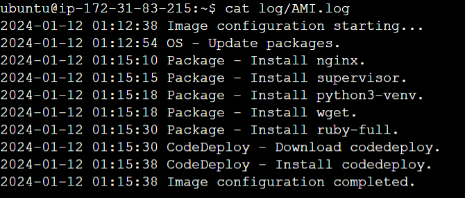

# EC Django Deployer

- [EC Django Deployer](#ec-django-deployer)
  - [Overview](#overview)
  - [Features](#features)
  - [Use Cases](#use-cases)
  - [Demo](#demo)
  - [Diagram](#diagram)
  - [Documentation](#documentation)
    - [Deployment Overview](#deployment-overview)
    - [Save EC2 Instance Information in the Database](#save-ec2-instance-information-in-the-database)
    - [Provision EC2 Instance to host Django project](#provision-ec2-instance-to-host-django-project)
      - [Create a Golden Image](#create-a-golden-image)
      - [Create a Launch Template](#create-a-launch-template)
    - [Provision EC2 using boto3](#provision-ec2-using-boto3)
    - [Deployment steps](#deployment-steps)
      - [Create an EC2 Instance as this project's server](#create-an-ec2-instance-as-this-projects-server)
      - [Create `.ven` file](#create-ven-file)
      - [Implement Continuous Integration and Deployment (CICD)](#implement-continuous-integration-and-deployment-cicd)

---

## Overview

- `EC Django Deployer` is a streamlined solution designed to simplify the deployment process of Django applications on AWS EC2 instances.
- Ideal for developers looking to deploy Django applications on AWS without the complexities of manual setup.

---

## Features

- **CICD Implementation**:

  - Use AWS `CodeBuild`, `CodePipeline`, and `CodeDeploy` Integration
  - Automates the entire deployment pipeline, from source code changes to EC2 instance provisioning and application deployment.

- **Simplified Deployment:**

  - Requires only two arguments: the **name of the Django project** and the **GitHub repository URL**.

- **GitHub Repository Structure:**

  - Enforces a rule for the target Django project's directory structure:
    - The project directory must be located in a direct child subdirectory of the GitHub repository, ensuring a consistent and organized layout.

- **EC2 Instance Provisioning**:
  - Utilizes a predefined `EC2 instance template` with `user data` to host the Django application.
  - Leverages `AWS SDK boto3` to provision infractures.

---

## Use Cases

- **Development Teams**:

  - Facilitates quick and hassle-free deployment of Django projects on AWS for development teams, enabling developers to **focus on coding instead of managing deployment infrastructure**.

- **Solo Developers and Small Projects**:

  - Ideal for solo developers or small projects **with minimal infrastructure requirements**.
  - Offers an efficient and automated solution for deploying Django applications on AWS **without the need for extensive DevOps expertise**.

---

## Demo

- video

- screenshot

---

## Diagram


- **EC Django Deployer CICD Workflow**:

  - EC Django Deployer developer commits and pushes new version to the GitHub repository, triggering the CICD workflow using CodePipeline, CodeBuild, and CodeDeploy.

- **Target Django Project Deployment Workflow**:

  - 1. Target Django Project owner signs into the EC Django Deployer website with domain name and creates a provision request.
  - 2. Provision request saves the information of the target Django project.
  - 3. A new EC2 instance is provisioned using AWS SDK boto3, predefined AMI, and user data script.

- **Public users access to Target Project**:
  - Once the target project's deployment finishes, public users can access to target project using the EC2 instance's public IP address.

---

## Documentation

### Deployment Overview

- This project uses the approach of `Django + Gunicorn + Nginx + Supervisor` to deploy Django project.
- The sequential steps includes:

  - update OS packages
  - upgrade OS packages
  - Install Nginx package
  - Install Supervisor package
  - Install CodeDeploy
  - Install python3-venv
  - Create python virtual environment
  - Install Gunicorn within venv
  - Clone target Django project's GitHub
  - Activate venv
  - Install target project's dependencies
  - Configure Gunicorn
  - Configure Nginx
  - Configure Supervisor
  - Migrate database
  - Start gunicorn, ngnix, supervisor

- To improve user experience and automate deployment, the deployment steps should be well-organized:

  - using a `Golden Image` to pre-configure the deployment environment.
  - using `user data` script to automate deployment configuration when an EC2 instance is provisioned.

- **Bash script** is helpful to automate the deployment steps.

---

### Save EC2 Instance Information in the Database

- When users initiate the deployment process by clicking the "create" button, the project not only provisions EC2 instances but also intelligently records essential details in the database.

- **Implementation Steps**

  - **Django Class-Based View**:

    - The project employs Django's class-based views, specifically overriding the post function, to handle deployment requests.
    - Upon successful form validation, deployment information is prepared for storage.

  - **Database Storage**:
    - Utilizing Django's `update_or_create()` function, the project securely saves the deployment details into the database.
    - When EC2 instances are provisioned accordingly leveraging the AWS SDK boto3, the instance ID are saved into the database.

- **Code**:

```py
def post(self, request, *args, **kwargs):
    # get the form
    form = self.form_class(request.POST)

    # check if the form is valiated
    if form.is_valid():

        # Creates new instance record
        obj, created = Instance.objects.update_or_create(
            name=form.cleaned_data["name"],
            github_url=form.cleaned_data["github_url"],
            project_name=form.cleaned_data["project_name"],
            description=form.cleaned_data["description"],
        )

        # Creates an new EC2 instance
        ec2 = create_instance_by_template(
            EC2_TEMPLATE,
            form.cleaned_data["name"],
            user_data
        )

        # get the instance id when it is created
        obj.instance_id = ec2[0]["instance_id"]

        # update the instance id with record
        obj.save()

        # redirect to the detail page
        return redirect("ECDeploy:detail", pk=obj.pk)

    return render(request, self.template_name, {"form": form})

```

---

### Provision EC2 Instance to host Django project

#### Create a Golden Image

- To improve the performance of provision, this project create a golden image.
- The Golden Image contains:

  - update and upgrade OS packages
  - Install CodeDeploy package
  - Install Nginx, Supervisor, python3-venv package

- To create the Golden Image, a user data script is created:

  - Bash script: [userdata_image.sh](./user_data/userdata_image.sh)

- Create an EC2 instance for golden Image and check the log.



- Save the image as a Golden Image


---

#### Create a Launch Template

- using the Golden Image


---

### Provision EC2 using boto3

- This project defines custom functions using the AWS SDK boto3 to provision EC2 instance to host user's Django project. [aws_ec2_script.py](./EC_Django_Deployer/ECDeploy/aws_ec2_script.py)
  - using launch template
  - boto3 function `create_instances()`
  - return the instance's information such as ID, public IP, and etc.

```py
def create_instance_by_template(launch_template_name, instance_name=None, user_data=None):
    ''' Creates an instance from a launch template '''

    if launch_template_name == None:
        raise ValueError("Parameter launch_template_name is required.")
    else:
        ec2 = boto3.resource(
            service_name='ec2',
            region_name='us-east-1'
        )
        ec2_list = ec2.create_instances(
            # launch template
            LaunchTemplate={
                "LaunchTemplateName": launch_template_name
            },
            # name tag
            TagSpecifications=[
                {
                    'ResourceType': 'instance',
                    'Tags': [
                        {
                            'Key': 'Name',
                            'Value': instance_name
                        },
                    ]},
            ],
            MinCount=1,
            MaxCount=1,
            UserData=user_data,
        )
        return [
            {
                "instance_id": instance.instance_id,
                "public_ip": instance.public_ip_address,
                "status": instance.state["Name"],
                "launch_time": instance.launch_time.strftime("%Y-%m-%d %H:%M:%S")
            }
            for instance in ec2_list
        ]
```

- This project also create a user data template that custom functions will overwrites to provision EC2 intabase based on user's parameters.[userdata_boto3.sh](./EC_Django_Deployer/ECDeploy/userdata_boto3.sh)

---

### Deployment steps

#### Create an EC2 Instance as this project's server

- Using Launch Template
- Using Golden Image


---

#### Create `.ven` file

- via SSH / using SSM


---

#### Implement Continuous Integration and Deployment (CICD)

- **AWS CodeDeploy application specification files**

  - This project implements a robust Continuous Integration and Deployment (CICD) pipeline using `AWS CodeDeploy`. The deployment process is defined by an `appspec.yml` file, which orchestrates the following three main phases:

  1. [BeforeInstall.sh](./CodeDeploy/BeforeInstall.sh)

     - Removes the existing virtual environment directory and GitHub repository directory.

  - Ensures a clean slate before the new deployment.

  2. [AfterInstall.sh](./CodeDeploy/AfterInstall.sh)

     - Creates a virtual environment.
     - Installs project dependencies and Gunicorn.
     - Configures Gunicorn, Nginx, and Supervisor.
     - Sets up the necessary environment for the application.

  3. [ApplicationStart.sh](./CodeDeploy/ApplicationStart.sh)
     - Handles tasks like migrating the database for Django.
     - Restarts the service to apply the changes.
     - Ensures a smooth transition to the updated version of the application.

  - **Deployment Logging**

    - To facilitate troubleshooting and traceability, a detailed log file named `deploy.log` is created in the `/home/ubuntu/log` directory.
    - This log captures key steps during the deployment process, providing valuable insights into the CICD pipeline.
    - In case of any issues during the deployment, consult the `deploy.log` file for a comprehensive record of the deployment steps.

- Create a `AWS CodePipeline`


- Push local code to GitHub and trigger Deployment

---

---

[TOP](#ec-django-deployer)
